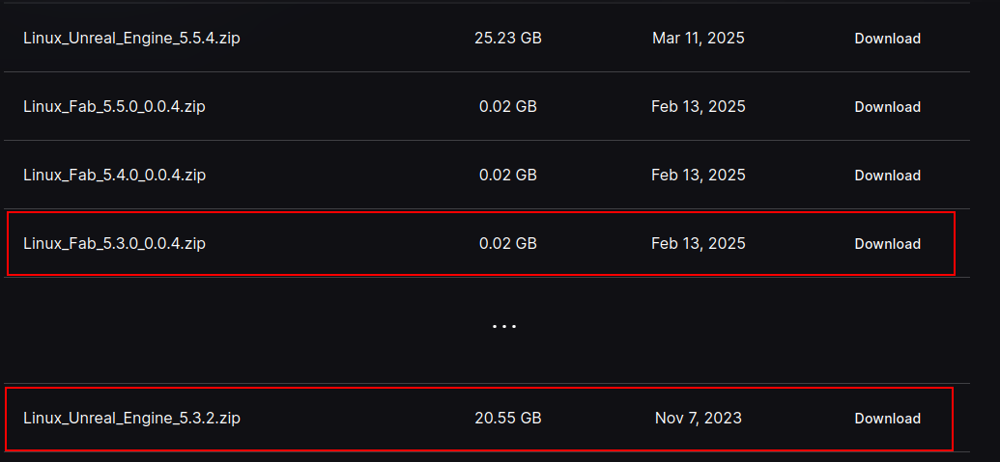

# UE 5.3 Installation

## Content

- [Recommended Hardware](#recommended-hardware)
- [Install from Binary](#install-from-binary)
  - [Ubuntu](#ubuntu-binary-install)
- [Install from Source](#install-from-source)
  - [Ubuntu](#ubuntu-source-install)

## Recommended Hardware

The following is the recommended hardware for **Linux** development.

- Ubuntu 22.04
- Quad-core Intel or AMD, 2.5 GHz or faster
- 32 GB RAM
- GeForce 960 GTX or Higher
- Graphics RAM >8GB

For more, check out [the official recommendation](https://dev.epicgames.com/documentation/en-us/unreal-engine/linux-development-requirements-for-unreal-engine?application_version=5.3).

## Install from Binary

### Ubuntu (Binary Install)

Create a folder for your installation

```bash
mkdir UnrealEngine
```

Go to the official Linux binary website <https://www.unrealengine.com/en-US/linux>.
Download `Linux_Unreal_Engine_5.3.2.zip` and `Linux_Fab_5.3.0_0.0.4.zip` into the folder.

> Press `Show earlier releases` if you are unable to find the desired version.



After downloading, make sure **both files are in the same folder** and unzip.

```bash
$ ls UnrealEngine/
Linux_Fab_5.3.0_0.0.4.zip
Linux_Unreal_Engine_5.3.2.zip
```

Next unzip both files, both files are combined into `UnrealEngine`.

```bash
cd UnrealEngine
unzip Linux_Unreal_Engine_5.3.2.zip
unzip Linux_Fab_5.3.0_0.0.4.zip
```

After unzipping, to run the Unreal Editor

```bash
cd Engine/Binaries/Linux
./UnrealEditor
```


## Install from Source

### Ubuntu (Source Install)

Duraion: 2-3hrs

**Prerequisite

**Access to Source Code**

Follow [the official guide](https://github.com/EpicGames/Signup) to obtain access to the repository.

**Download Source Code**

After obtaining access to the GitHub Repository (<https://github.com/EpicGames/UnrealEngine>).

Proceed to download the source code. This will take a while (20-30min).

> We suggest to use our fork, since it contains the Fab plugin.
> If you want to use the official version <https://github.com/EpicGames/UnrealEngine>
> at tag `5.3.2-release`, please remember to [**upgrade the Fab plugin additionally**](./troubleshooting.md##install-missing-ue5-fab-plugin-linux) after completing the following steps.

```bash
git clone git@github.com:cy-ca/UnrealEngine.git --branch 5.3.2-fab
```

Run the `Setup.sh`, make sure you have a good Internet connection.

```bash
cd UnrealEngine
./Setup.sh
```

The script will try to install additional packages (for certain distributions) and download precompiled binaries of third party libraries. It will also build one of the libraries on your system (LinuxNativeDialogs or LND for short).

Generate `Makefile` (and `CMakeLists.txt`)

```bash
./GenerateProjectFiles.sh
```

**Compilation**

To compile simply run

```bash
make
```

If you intend to develop the editor, you can build a debug configuration of it:

```bash
make UnrealEditor-Linux-Debug
```

(note that it will still use development ShaderCompileWorker / UnrealLightmass). This configuration runs much slower.

If you want to rebuild the editor from scatch, you can use

```bash
make UnrealEditor ARGS="-clean" && make UnrealEditor
```

**Run**

To run the Unreal Editor

```bash
cd Engine/Binaries/Linux
./UnrealEditor
```

